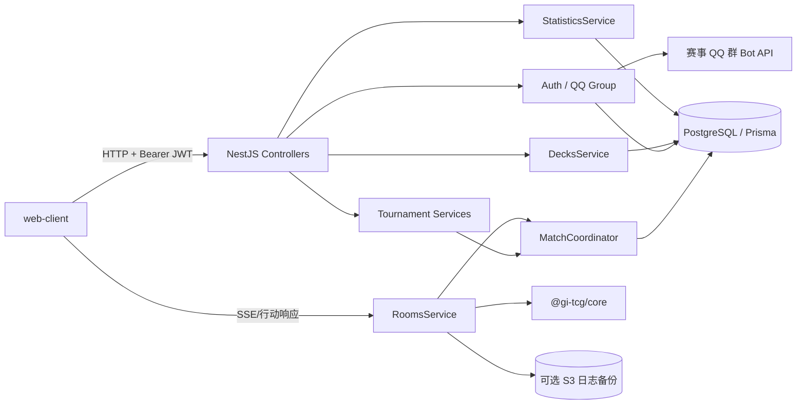
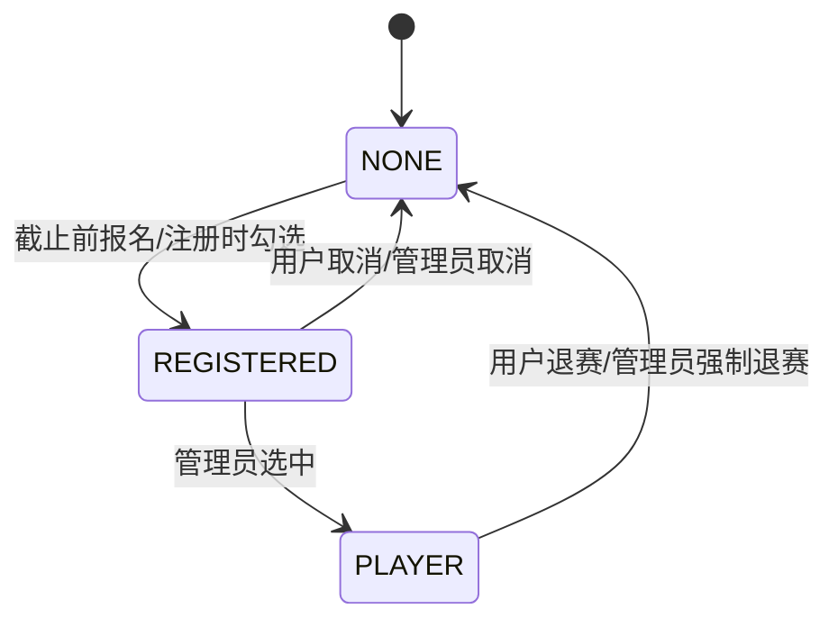

# 恋雨杯 S1 后端设计文档

> 对应需求：[requirements.md](./requirements.md)  
> 补充规则：[QQ 群接口](./qq_group.md)、[按场次的玩家筛选排序](./round_based_filter_sort.md)

## 1. 目标与范围

本文描述 `packages/server` 为恋雨杯 S1 所需的后端改造，覆盖：

- QQ 注册、密码与 Passkey 登录、管理员鉴权；
- 报名、候补提示和参赛状态管理；
- 场次、盘次、比赛对局三层赛事模型；
- 比赛牌组收集、固化和决斗/征服模式下的牌组耗尽；
- 普通房间、游客对局与赛事对局统一入库；
- 管理员调度、介入、审计、导出、筛选排序和业务统计；
- 对现有内存房间、SSE、核心模拟器和 Prometheus 指标的兼容。

不在本次范围内：多赛事赛季系统、支付、消息推送、裁判申诉流程、服务重启后恢复进行中的核心对局。赛事按 S1 单赛季设计，但表结构保留未来增加赛季字段的空间。

## 2. 现状与总体原则

现有后端为 NestJS + Fastify + Prisma/PostgreSQL：

- `RoomsService` 在单进程内维护 `Room` 和正在运行的 `@gi-tcg/core` 游戏；
- 玩家通过 SSE 接收通知，通过 HTTP 回传行动；
- 普通对局结束后才写入 `Game`，只要存在游客就完全不入库；
- `User.id` 当前等于 GitHub ID，用户信息依赖 GitHub API；
- `/metrics` 是 Prometheus 运行指标，不是需求中的业务统计面板。

改造遵循以下原则：

1. 保留 `Room`、SSE 和核心游戏循环，不把高频游戏状态写入数据库。
2. 数据库中的赛事对局只持久化“未开始/已结束”；“进行中”继续由内存态覆盖。
3. 对局原始结果与管理员修正结果分开保存；业务统计永远读取原始结果。
4. 盘次结算、牌组耗尽和自动创建下一局在同一数据库互斥区内完成。
5. 所有权限、阶段、牌组和人数限制都由后端最终校验，前端禁用只用于改善体验。
6. 本项目启用新数据库，直接重写 Prisma Schema 和首个 migration，不兼容旧库数据。

普通房间的对局版本继续由服务器加载的赛事外部配置决定；`CreateRoomDto` 不再接受客户端 `gameVersion`，避免界面选择值与实际运行版本不一致。

## 3. 术语与确定口径

代码和接口统一使用如下命名：

| 中文概念 | 代码名             | 说明                                   |
| -------- | ------------------ | -------------------------------------- |
| 场次     | `TournamentEvent`  | 一批盘次的发布与阶段容器               |
| 盘次     | `TournamentMatch`  | 固定 1～2 位选手的一轮比赛             |
| 对局     | `Game`             | 一次实际模拟器游戏；赛事与普通房间共用 |
| 盘次选手 | `MatchParticipant` | 选手在盘次中的席位及退赛状态           |
| 比赛牌组 | `MatchDeck`        | 与盘次选手绑定、可固化和耗尽的牌组快照 |

需求中有歧义的地方按以下口径落地：

- 注册时密码和 Passkey 二选一，至少配置一种认证方式；数据结构支持后续增加多个 Passkey。
- 报名限额不阻止继续报名。按 `appliedAt` 升序计算名次，名次大于限额时标记为候补；限额为 `0` 表示不限。
- `countForStats=false` 只排除业务 metrics，不影响“已结束局数”和盘次胜局统计。模拟器报错且没有赢家时只增加已结束局数。
- 盘次胜局按 `manualWinnerWho ?? winnerWho` 计算；业务 metrics 只按 `winnerWho` 计算。
- “行动牌单卡出场”按某副牌是否包含该卡计一次，不按牌组中的复制张数重复计数。
- 三角色组合统一将角色 ID 升序排序后生成键，因此角色顺序不影响唯一性和统计。
- 管理员身份由数据库角色判定；指定 QQ 只用于初始化或授予该角色，不实现隐藏后门账户。

## 4. 总体架构



建议的模块边界：

- `AuthModule`：密码、Passkey、JWT 和注册流程；
- `QqGroupModule`：群成员 API 适配、缓存、错误映射；
- `UsersModule`：个人信息、报名状态和管理员用户列表；
- `RegistrationModule`：报名设置、报名/取消报名；
- `TournamentsModule`：场次、盘次、参赛席位、比赛牌组；
- `MatchCoordinatorModule`：赛事对局创建、结束结算、管理员介入和互斥；
- `GamesModule`：所有对局的持久化和日志读取；
- `RoomsModule`：普通房间与固定席位赛事房间的内存运行态；
- `StatisticsModule`：业务 metrics 和按场次筛选排序；
- `AuditModule`：管理员操作审计；
- 原 `MetricsModule` 保留为 Prometheus 运行指标，不承载业务统计。

Controller 只做 DTO 校验、身份解析和响应转换。跨 `Game`、`TournamentMatch`、`MatchDeck` 的写操作必须进入 `MatchCoordinatorService`，避免多个 service 各自实现一半事务。

## 5. 数据模型

### 5.1 枚举

```text
UserRole               USER | ADMIN
CompetitionStatus      NONE | REGISTERED | PLAYER
EventPhase             DECK_COLLECTION | RUNNING | FINISHED
MatchMode              UNRESTRICTED | DUEL | CONQUEST
ParticipantStatus      ACTIVE | WITHDRAWN
GameStatus             PENDING | FINISHED
GameEndReason          NORMAL | ENGINE_ERROR | SURRENDER | ADMIN
MatchDeckDisableReason DUEL_USED | CONQUEST_WINNER_USED | ADMIN
```

数据库中只保存 `GameStatus.PENDING` 和 `FINISHED`。接口根据 `RoomsService` 的映射额外返回 `runtimeStatus: "WAITING" | "PLAYING" | null`。

### 5.2 User 与认证

#### `User`

| 字段                  | 类型                | 约束/用途                                    |
| --------------------- | ------------------- | -------------------------------------------- |
| `id`                  | `Int`               | 自增主键，不再使用 QQ/GitHub ID 作为主键     |
| `qq`                  | `String`            | 唯一、不可修改，规范化为无前导零的数字字符串 |
| `name`                | `String`            | 1～64 字符，可修改                           |
| `passwordHash`        | `String?`           | Argon2id；Passkey-only 用户为空              |
| `role`                | `UserRole`          | 默认 `USER`                                  |
| `competitionStatus`   | `CompetitionStatus` | 普通、已报名、参赛选手                       |
| `appliedAt`           | `DateTime?`         | 最近一次报名时间，用于排序和候补名次         |
| `activeMatchId`       | `Int?`              | 当前活跃场次中的唯一盘次，作为单盘约束       |
| `chessboardColor`     | `String?`           | 沿用现有字段                                 |
| `createdAt/updatedAt` | `DateTime`          | 审计时间                                     |

`qq` 校验为 `^[1-9]\d{4,19}$`。头像不入库，由接口返回
`https://q1.qlogo.cn/g?b=qq&nk=<qq>&s=640`。

`activeMatchId` 是对历史 `MatchParticipant` 关系的冗余指针：创建活跃场次时设置，场次结束或选手退赛时清空。它让“一个选手只能处于一个活跃场次的一个盘次中”成为可加锁、可索引的数据库约束，而不是仅靠跨表查询约定。

#### `PasskeyCredential`

保存 `credentialId`（唯一）、`userId`、COSE 公钥、签名计数器、transports、device type、backed-up 标记、创建及最后使用时间。验证成功后必须原子更新计数器；检测到计数器倒退时拒绝登录并记录安全日志。

#### `AuthChallenge`

保存一次性 WebAuthn 流程：随机 `id`、`kind`、`challenge`、`qq/userId`、注册上下文 JSON、`expiresAt`、`consumedAt`。有效期 5 分钟。verify 时在事务内消费，保证多实例部署和重复提交安全；定时删除过期记录。

#### `RegistrationSettings`

单行配置（固定 `id=1`）：`deadline`、`limit`、`updatedByUserId`、`updatedAt`。部署前必须 seed；`limit=0` 表示不限额。

### 5.3 牌组

#### `Deck`

保留现有 `id/name/code/requiredVersion/ownerUserId/createdAt/updatedAt`，增加：

- `clientImportKey String?`：游客牌组批量上传的幂等键；
- 唯一键 `(ownerUserId, clientImportKey)`，空值不参与冲突。

角色列表和行动牌仍以 `code` 为事实来源，通过 `AssetsManager` 解码。写入 `MatchDeck` 和 `GamePlayer` 时保存结构化 JSON 快照，避免以后卡牌编码或用户牌组变化影响历史记录。

### 5.4 场次、盘次和比赛牌组

#### `TournamentEvent`

| 字段                             | 说明                         |
| -------------------------------- | ---------------------------- |
| `id/name`                        | 自增 ID、场次名称            |
| `phase`                          | 收集牌组中、进行中、已结束   |
| `deckLimit`                      | `0` 不限，否则为每位选手上限 |
| `createdByUserId`                | 创建管理员                   |
| `createdAt/updatedAt/finishedAt` | 时间信息                     |

#### `TournamentMatch`

| 字段                          | 说明                                 |
| ----------------------------- | ------------------------------------ |
| `id/eventId`                  | 盘次主键及所属场次                   |
| `scheduledStart/scheduledEnd` | 只作展示，不触发定时任务             |
| `mode`                        | 无限制、决斗、征服                   |
| `roomConfig`                  | 固化的默认房间设置 JSON              |
| `maxGames/winsRequired`       | 满足 `maxGames >= winsRequired >= 1` |
| `winnerUserId`                | 可空；自动结算或管理员指定           |
| `autoCreateGame`              | 是否允许自动创建下一局               |
| `autoCreateDisabledReason`    | 管理员介入等关闭原因                 |
| `createdAt/updatedAt`         | 时间信息                             |

盘次“完成”不另存布尔值，由以下条件派生：

```text
winnerUserId != null
OR finishedGameCount >= maxGames
```

#### `MatchParticipant`

字段为 `id/matchId/userId/side/status/withdrawnAt`，其中 `side` 只能是 `0/1`。约束：

- `(matchId, side)` 唯一；
- `(matchId, userId)` 唯一；
- 每盘允许 1～2 条记录；一条记录表示轮空盘；
- 历史记录不因退赛删除，而是改为 `WITHDRAWN`。

#### `MatchDeck`

| 字段                                         | 说明                              |
| -------------------------------------------- | --------------------------------- |
| `id/matchParticipantId`                      | 比赛牌组和选手席位                |
| `sourceDeckId`                               | 原用户牌组 ID；历史导出仍使用快照 |
| `name/deckJson`                              | 名称及 `{characters, cards}` 快照 |
| `characterKey`                               | 三角色 ID 升序后用 `:` 连接       |
| `usable`                                     | 决斗/征服模式下是否仍可选择       |
| `disabledReason/disabledByGameId/disabledAt` | 耗尽来源                          |
| `createdAt/updatedAt`                        | 时间信息                          |

`(matchParticipantId, sourceDeckId)` 和 `(matchParticipantId, characterKey)` 都唯一。收集阶段选中牌组时建立记录；编辑比赛牌组时同步快照；取消设置时删除记录。进入进行中后禁止用户增删或编辑，记录转为历史事实。场次结束后不物理删除，接口不再把它们视作当前比赛牌组，从而同时满足“清除比赛牌组”和历史导出。

### 5.5 对局

#### `Game`

| 字段                          | 说明                                    |
| ----------------------------- | --------------------------------------- |
| `id`                          | 自增主键，也是赛事对局的稳定 ID         |
| `matchId`                     | 可空；非空即赛事对局，无需额外布尔字段  |
| `status`                      | 数据库仅 `PENDING/FINISHED`             |
| `coreVersion/gameVersion`     | 模拟器 commit hash、配置版本            |
| `endReason`                   | 正常、引擎报错、投降、管理员介入        |
| `winnerWho`                   | 原始赢家 `0/1/null`，统计唯一使用该字段 |
| `manualWinnerWho`             | 管理员指定 `0/1/null`                   |
| `countForStats`               | 默认 true；引擎错误自动 false           |
| `stateLog`                    | JSON，可空；赛事导出不包含              |
| `createdAt/startedAt/endedAt` | 时间信息                                |

#### `GamePlayer`

每局固定最多两条，字段为：`gameId`、`who`、`userId?`、`playerName`、`deckId?`、`deckJson?`。主键 `(gameId, who)`，`who` 只能是 `0/1`。游客的 `userId/deckId` 可空，但 `playerName/deckJson` 在真实开始过的对局结束入库时必须存在。

赛事对局创建时先写入两条带 `userId` 的 `GamePlayer`，牌组字段为空；双方进入房间、游戏实际开始前再一次性回填牌组 ID 和 JSON。普通房间可在开局时创建记录，也可在结束时一次性写入，但最终必须包括游客牌组。

### 5.6 审计

`AuditLog` 保存：`id`、`actorUserId`、`action`、`targetType`、`targetId`、`before`、`after`、`reason?`、`requestId?`、`createdAt`。

至少审计以下操作：

- 管理员批量更改报名/参赛状态、取消报名、强制退赛；
- 修改报名截止时间和限额；
- 创建、修改和步进场次；
- 自动胜利、手动创建对局、修改对局/盘次赢家或状态；
- 修改 `countForStats`；
- 管理员直接指定比赛牌组。

审计记录与业务变更在同一事务中写入。审计 API 只对管理员开放且不提供删除接口。

### 5.7 数据库约束与索引

Prisma Schema 之外，首个 migration 增加必要的 PostgreSQL check/partial index：

- `MatchParticipant.side`、`GamePlayer.who`、赢家字段只能是 `0/1`；
- `maxGames >= winsRequired AND winsRequired >= 1`；
- 每个盘次至多一个 `PENDING` 对局的 partial unique index；
- `Game(matchId, status, createdAt)`、`Game(status, countForStats)`；
- `User(competitionStatus, appliedAt)`、`User(activeMatchId)`；
- `TournamentEvent(phase)`、`TournamentMatch(eventId)`；
- `GamePlayer(userId, gameId)`、`MatchParticipant(userId, matchId)`。

数据库约束是最后防线；service 仍需返回可读的业务错误，而不是直接暴露唯一键异常。

## 6. 认证与 QQ 群校验

### 6.1 QQ 群成员客户端

`QqGroupService` 调用 `POST ${BOT_SERVER_ORIGIN}/get_group_member_list`，携带 Bearer token、固定/可配置群号和 `{ no_cache: true }`。

- 列表可在进程内缓存 30 秒，供注册第一步和昵称预填使用；
- 最终注册和点击报名必须强制刷新，不使用本地缓存；
- 上游超时 5 秒，失败时 fail closed，返回 `503 QQ_GROUP_SERVICE_UNAVAILABLE`；
- 日志不得记录 Bot token、注册码、密码或完整 Passkey 响应；
- 只向前端返回目标 QQ 是否存在及其群昵称，不暴露完整群成员列表。

### 6.2 注册码格式

固定格式：

```text
v1.<expiresAt>.<signature>
```

- `expiresAt`：十进制 Unix 秒；
- 待签名内容：`lianyu-s1-register\n<qq>\n<expiresAt>`，UTF-8；
- `signature`：`HMAC-SHA256(REGISTRATION_CODE_SECRET, message)` 的无 padding base64url；
- 服务端校验版本、QQ、过期时间，并用 constant-time compare 比较签名；
- 注册码可在有效期内重放，但同一 QQ 的数据库唯一键保证不能重复注册。

实现时提供：

- `packages/server/scripts/generate-registration-code.py`：Bot 侧可直接复用的 Python 生成实现；
- `packages/server/src/auth/registration-code.ts`：Node 验证实现；
- 同一组固定 secret/QQ/时间戳的跨语言测试向量。

### 6.3 注册流程

1. `POST /auth/registration/qq-check` 校验 QQ 是否在群中，返回群昵称；前端据此解锁后续字段。
2. 密码注册调用 `POST /auth/register/password`；服务端重新校验群成员、注册码、昵称、确认已知晓比赛平台和 QQ 唯一性，Argon2id 哈希密码后创建用户。
3. Passkey 注册先调用 `POST /auth/register/passkey/options`。该接口完成同样的业务校验并把注册上下文写入 `AuthChallenge`，返回 `flowId + PublicKeyCredentialCreationOptionsJSON`。
4. 浏览器调用 WebAuthn 后，将结果交给 `POST /auth/register/passkey/verify`。服务端消费 challenge、创建 User 和 PasskeyCredential。
5. 注册成功均返回 JWT、`UserInfo` 和报名结果。如果勾选同时报名，在创建用户的同一事务中写入报名状态；QQ 群的最终校验结果在短流程内复用。

并发注册依靠 `User.qq` 唯一键收敛为 `409 QQ_ALREADY_REGISTERED`。

### 6.4 登录与 JWT

- 密码：`POST /auth/login/password`，参数为 QQ 和密码；
- Passkey：`POST /auth/login/passkey/options` 后调用 `POST /auth/login/passkey/verify`；
- JWT payload 为 `{ sub: userId, kind: "user" }`，不把可变角色作为唯一授权依据；
- 现有游客 JWT 保留，payload 为 `{ sub: guestId, kind: "guest" }`；
- Web 客户端继续使用 `Authorization: Bearer`，JWT 建议 12 小时过期；
- 管理员 guard 每次从数据库读取角色或使用短 TTL 角色缓存，以便撤权及时生效；
- 密码登录按 IP + QQ 限流，错误统一返回 `INVALID_CREDENTIALS`，避免枚举账号。

Passkey 使用 `@simplewebauthn/server` 一类经过维护的实现；RP ID、origin 和显示名通过环境变量配置。生产环境必须使用 HTTPS。

## 7. 报名与参赛状态

状态流转：



规则：

- 报名时检查 `now < deadline`，等于截止时间视为关闭；
- 再次实时检查 QQ 群成员身份；
- `queuePosition` 为所有 `REGISTERED/PLAYER` 用户按 `appliedAt,id` 的稳定序号；`limit=0` 时永不候补，否则 `queuePosition > limit` 为候补；
- 候补只影响提示，不阻止管理员设为 `PLAYER`；
- 用户取消报名或退赛前，通过 `RoomsService` 检查是否在运行中的房间；正在进行则返回 `409 USER_IN_RUNNING_GAME`；
- 退赛时将当前 `MatchParticipant` 标记为 `WITHDRAWN` 并清空 `User.activeMatchId`；若存在尚未开始的开放赛事对局，将其以 `ADMIN/countForStats=false` 终结并关闭该盘自动创建，避免遗留不可进入的对局；
- 管理员批量操作逐个返回成功/失败项，事务按用户执行，不能因一项冲突静默跳过全部选择。

## 8. 比赛牌组

### 8.1 用户操作

用户设置比赛牌组时后端必须在事务内：

1. 加锁用户和 `activeMatchId`；
2. 校验用户为 `PLAYER`、盘次选手为 `ACTIVE`、场次阶段为 `DECK_COLLECTION`；
3. 验证牌组归属和合法性；
4. 生成排序后的 `characterKey`，检查本盘不存在相同角色组合；
5. 检查 `deckLimit`（0 不限）；
6. 写入带结构化 JSON 的 `MatchDeck`。

取消设置、删除比赛牌组、编辑比赛牌组执行相同阶段校验。编辑时：

- 三个角色的 multiset 必须与旧快照相同，允许调整顺序；
- 行动牌和名称可修改；
- 同步更新 `Deck` 和 `MatchDeck.deckJson/name`；
- 若要更换角色，必须取消设置后新建或选择另一副牌。

非比赛牌组不受阶段限制。比赛牌组在 `RUNNING/FINISHED` 阶段拒绝用户删除或编辑。

### 8.2 场次步进与固化

`DECK_COLLECTION -> RUNNING` 的事务会重新读取每条源 Deck、验证并刷新 `MatchDeck` 快照，随后创建满足条件的首局赛事对局。之后所有赛事房间只读取 `MatchDeck.deckJson`，不读取用户可变的 Deck 内容。

`RUNNING -> FINISHED` 会：

- 终止该场次仍在内存中运行的房间；
- 将所有 `PENDING` 对局以管理员介入结束且不计统计；
- 关闭所有盘次的自动创建；
- 清空相关用户的 `activeMatchId`；
- 保留 `MatchDeck` 历史快照，但不再作为用户当前比赛牌组返回。

阶段只能向前步进，不允许回退。

### 8.3 管理员指定

管理员可在任意非结束场次为某位盘次选手指定牌组，仍需满足牌组归属、合法性、数量限制和角色组合唯一性。进行中指定时立即生成新快照并设为 `usable=true`；这是显式纠错能力，必须填写原因并记录审计。

## 9. 场次和盘次管理

### 9.1 批量创建

创建请求包含场次元信息、统一盘次模板、`player0Ids[]` 和 `player1Ids[]`。服务端按索引配对：

```text
match[i] = player0Ids[i]? + player1Ids[i]?
```

仅一侧存在时创建轮空盘。校验所有用户：

- 已是 `PLAYER`；
- 请求中没有重复；
- `activeMatchId` 为空；
- 仍未处于其他活跃场次。

整个场次、全部盘次、席位和用户 `activeMatchId` 在一个事务内创建。任一用户冲突则整次创建失败并返回冲突用户列表。场次创建后禁止增删盘次。

建议默认初始阶段为 `DECK_COLLECTION`。接口允许管理员选择 `RUNNING`，但会立即固化当时已由管理员指定的牌组并触发首局创建；选择 `FINISHED` 没有业务意义，拒绝创建。

### 9.2 可编辑字段

- `DECK_COLLECTION`：可编辑场次名称、牌组上限，以及盘次日程、模式、局数、胜局数、房间配置、自动创建开关；不可改变选手和盘次数量。
- `RUNNING`：可编辑展示名称、预计时间和显式自动创建开关；模式、局数、胜局数和房间配置锁定。
- `FINISHED`：只读和导出。

管理员介入关闭自动创建后，不会隐式恢复；若管理员确需恢复，必须单独修改开关并记录审计。

### 9.3 导出

`GET /admin/events/:eventId/export` 返回下载用 JSON：

- 场次全部元信息；
- 每盘元信息、双方选手和比赛牌组快照；
- 收集阶段导出当前 `MatchDeck`，其后导出已固化快照；
- 每局版本、玩家、牌组、状态、结束原因、原始/手动赢家和统计开关；
- 明确排除 `stateLog`、密码、Passkey、QQ Bot 信息和审计内部字段。

响应带 `Content-Disposition`，文件名使用 `event-<id>-<timestamp>.json`。

## 10. 赛事对局与内存房间

### 10.1 创建对局

创建下一局的前置条件：

- 场次为 `RUNNING`；
- 盘次有两位 `ACTIVE` 选手；
- 盘次未完成；
- 不存在其他 `PENDING` 对局（包括内存中进行的对局）；
- 自动触发时 `autoCreateGame=true`。

服务端每局独立随机交换两位选手，写入 `GamePlayer.who=0/1`，因此数据库里的 who 就是该局先后手。新 `Game` 为 `PENDING`，其版本和配置在创建时固化。

轮空或只剩一位 ACTIVE 选手时不建局。管理员可执行自动胜利，直接把该用户写为盘次赢家；双方都退赛时拒绝。

### 10.2 进入赛事房间

赛事房间不复用普通 `POST /rooms` 的任意配置入口，而走固定入口：

1. 用户读取 `GET /tournament-games/:gameId/join-options`；
2. 后端验证用户是该局的一方，并返回锁定的房间配置和可选牌组；
3. 用户提交 `POST /tournament-games/:gameId/join { deckId }`；
4. `RoomsService` 按 `gameId` 幂等创建/获取专用 Room，并通过 `setPlayer(who, player)` 放到数据库指定席位；
5. 第二位玩家进入时，在开局回调中一次性回填双方牌组 ID/JSON，再启动核心游戏；
6. 返回临时四位房间号，前端继续进入现有 `/rooms/:code` 棋盘页。

无限制模式允许选择用户所有合法牌组；决斗/征服模式只允许选择本盘 `usable=true` 的 `MatchDeck`，实际开局使用其固化 JSON。没有可用牌组时返回空列表，不自动判负。

Room 额外保存 `tournamentGameId` 和结束原因。服务重启后内存 Room 消失，但数据库仍为 `PENDING`；下次 join 会按同一 `gameId` 重新创建 Room，符合“进行中不持久化”的要求。

### 10.3 普通与游客对局入库

普通房间在双方实际开始后，无论用户或游客，都在结束时写入：

- 两个 `GamePlayer`，游客 `userId/deckId=null`；
- 两副完整牌组 JSON 和显示名；
- core/config 版本、原始赢家、结束原因、统计开关和 State Log。

只有房间从未真正开始时不入库。模拟器错误也入库，但 `endReason=ENGINE_ERROR` 且 `countForStats=false`。S3 上传继续作为可选备份，数据库写入失败必须记录高优先级日志并上报运行指标，不能被 S3 成功掩盖。

### 10.4 对局结束事务

正常/投降/引擎错误结束后，`MatchCoordinator.finalizeGame` 执行：

1. 获取该 `matchId` 的 PostgreSQL transaction advisory lock；
2. 幂等读取 Game；若已被管理员终结，不覆盖管理员字段；
3. 写入原始赢家、日志、结束原因、时间和统计开关；
4. 正常或投降时按模式耗尽比赛牌组：
   - `DUEL`：双方本局所用 `characterKey` 对应牌组设为不可用；
   - `CONQUEST`：原始/有效赢家所用牌组设为不可用；
   - `UNRESTRICTED`：不处理；
5. 统计本盘所有已结束局的有效赢家。达到胜局数时设置盘次赢家；
6. 若未达到胜局数但已结束局数达到 `maxGames`，盘次完成且赢家可空；
7. 若盘次未完成且允许自动创建，创建唯一下一局；
8. 提交事务后更新内存映射和运行指标。

所有创建新局入口使用同一 advisory lock。数据库 partial unique index防止代码缺陷产生两个开放对局。

### 10.5 管理员介入

对局介入和盘次赢家介入拆成两个显式接口，但可在前端一次确认后顺序调用：

- 正在内存运行的对局先调用 Room 的管理员终止信号，使双方 SSE 收到明确错误并停止核心结算；
- 事务内关闭 `autoCreateGame`，再修改目标对局状态、`manualWinnerWho`、结束原因和 `countForStats`；
- 允许将已结束局重新设为 `PENDING`，但若盘内已有其他开放局则拒绝；
- 允许直接设置/清空 `TournamentMatch.winnerUserId`；
- 不恢复任何已耗尽牌组；
- 不终止、不删除盘内其它已经自动创建的对局；
- 不自动创建补局，除非管理员之后明确恢复开关或手动创建；
- 每次介入要求 `reason` 并保存审计前后值。

如果管理员介入和核心结束同时到达，advisory lock 串行化两者；后提交者只更新其被允许的字段，不会丢失 State Log 或覆盖手动赢家。

## 11. 排名筛选算法

`POST /admin/rankings/preview` 接收 `eventIds[]`，只读取这些场次中已完成的盘次。

对每位参与盘数大于 0 的选手计算：

1. `played`：参与的已完成盘次数；
2. `won`：`winnerUserId` 等于该选手的盘次数；
3. `opponents`：该选手对阵过的不同对手集合，同一对手重复对阵只保留一次；轮空不产生对手；
4. 小分：`sum(opponent.won) / sum(opponent.played)`，分母 0 时为 0；
5. 小小分：对每位直接对手，取该对手的不同对手集合，再把各集合展开求 `sum(won) / sum(played)`。同一个二级对手若从不同直接对手路径出现，需要重复计入，符合补充文档示例；分母 0 时为 0。

最终按 `(won, tieBreak, secondTieBreak, userId)` 排序，前三项降序，`userId` 升序只用于稳定展示。接口同时返回各分子/分母和对手 ID，便于管理员核对，不只返回小数结果。

## 12. 业务统计

业务统计接口位于 `/admin/statistics/*`，与公开的 Prometheus `/metrics` 分离。

### 12.1 样本定义

纳入样本的 Game 必须：

- `status=FINISHED`；
- `countForStats=true`；
- 两个 `GamePlayer.deckJson` 都存在，即双方确实进行过对局。

`source=all|tournament|casual` 分别表示全部、`matchId != null`、`matchId == null`。

### 12.2 卡牌和组合

设样本对局数为 `G`，分母固定为 `2 * G`：

- 角色/行动牌/三角色组合出场数：出现在多少个玩家牌组中；
- 出场率：`appearances / (2*G)`；
- 胜场：该牌组所属 `who` 等于 `Game.winnerWho` 的次数；
- 胜率：`wins / appearances`；无出场时为 0；
- 三角色组合外战只保留双方 `characterKey` 不同的对局；外战胜率为外战胜场/外战出场数；
- `winnerWho=null` 的对局计出场但不计胜场；
- `manualWinnerWho` 不参与任何上述计算。

### 12.3 用户统计

按注册用户聚合样本中其作为 `GamePlayer.userId` 的对局：对局数、按原始赢家计算的胜场/胜率，以及所有使用过的牌组快照。牌组列表按完整 deck code/JSON 去重，并附使用次数、首次和最后使用时间。

数据量在 S1 规模下可由 PostgreSQL 拉取精简行后在 Node 聚合。若实际达到数十万局，再增加 `GamePlayer` 事实列或物化视图；首版不引入提前聚合，以免管理员修改统计开关后维护多份一致性。

## 13. API 设计

所有响应时间使用 ISO 8601 UTC 字符串。分页继续使用 `skip/take`。跨前后端 DTO 放入 `packages/typings/src/platform.ts`，controller 的 class-validator DTO 与共享响应类型分离。

### 13.1 公共与用户接口

| 方法与路径                               | 权限        | 用途                               |
| ---------------------------------------- | ----------- | ---------------------------------- |
| `GET /registration/settings`             | Public      | 截止时间、限额、报名数、是否开放   |
| `POST /auth/registration/qq-check`       | Public      | 群成员检查和昵称预填               |
| `POST /auth/register/password`           | Public      | 密码注册，可同时报名               |
| `POST /auth/register/passkey/options`    | Public      | Passkey 注册 options               |
| `POST /auth/register/passkey/verify`     | Public      | 完成 Passkey 注册                  |
| `POST /auth/login/password`              | Public      | QQ + 密码登录                      |
| `POST /auth/login/passkey/options`       | Public      | Passkey 登录 options               |
| `POST /auth/login/passkey/verify`        | Public      | 完成 Passkey 登录                  |
| `GET/PATCH /users/me`                    | User        | 当前资料；PATCH 只允许昵称和棋盘色 |
| `POST /users/me/registration`            | User        | 报名并返回候补信息                 |
| `DELETE /users/me/registration`          | User        | 取消报名或退赛                     |
| `GET /users/me/matches?active=true`      | User        | 我的活跃盘次和对局运行态           |
| `GET/POST/PATCH/DELETE /decks...`        | User/Public | 沿用现有牌组接口及游客版本校验     |
| `POST /decks/import`                     | User        | 幂等批量上传游客牌组               |
| `PUT /decks/:id/competition`             | User        | 设置比赛牌组                       |
| `DELETE /decks/:id/competition`          | User        | 取消比赛牌组                       |
| `GET /tournament-games/:id/join-options` | Participant | 锁定配置和可选牌组                 |
| `POST /tournament-games/:id/join`        | Participant | 进入/创建内存赛事房间              |

`GET /decks` 在原 `{data,count}` 基础上返回 `competitionContext`，每个 Deck 返回 `competition` 信息（是否选中、是否可用、是否可编辑、所属场次/盘次）。

### 13.2 管理员接口

| 方法与路径                                          | 用途                             |
| --------------------------------------------------- | -------------------------------- |
| `GET/PATCH /admin/registration/settings`            | 查看/修改报名设置                |
| `GET /admin/users`                                  | 按状态筛选、按报名时间排序       |
| `PATCH /admin/users/competition-status`             | 批量设置报名或参赛状态           |
| `POST /admin/rankings/preview`                      | 多场次排名预览                   |
| `GET/POST /admin/events`                            | 场次列表/批量创建                |
| `GET/PATCH /admin/events/:id`                       | 场次详情/允许字段编辑            |
| `POST /admin/events/:id/advance`                    | 单向步进阶段                     |
| `GET /admin/events/:id/export`                      | JSON 导出                        |
| `GET/PATCH /admin/matches/:id`                      | 盘次详情/允许字段编辑            |
| `POST /admin/matches/:id/games`                     | 手动创建新局                     |
| `POST /admin/matches/:id/auto-win`                  | 单人盘自动胜利                   |
| `PATCH /admin/matches/:id/intervention`             | 手动设置盘次赢家                 |
| `PUT /admin/matches/:id/participants/:userId/decks` | 管理员指定比赛牌组               |
| `PATCH /admin/games/:id/intervention`               | 对局状态、手动赢家、统计开关介入 |
| `GET /admin/statistics/cards`                       | 单卡/组合统计，支持 source       |
| `GET /admin/statistics/users`                       | 用户胜率和使用牌组，支持 source  |
| `GET /admin/audit-logs`                             | 审计检索                         |

管理员修改接口要求 CSRF 风险可控的 Bearer token、`reason` 字段（纯编辑展示名除外）和统一 `AdminGuard`。

场次、盘次和对局详情响应同时返回服务端计算的 `allowedActions` 及不可用原因，供管理界面正确禁用操作；这只是展示信息，mutation 接口仍需重新校验同一条件。

### 13.3 批量创建请求示例

```json
{
  "event": {
    "name": "小组赛第一轮",
    "initialPhase": "DECK_COLLECTION",
    "deckLimit": 3
  },
  "matchTemplate": {
    "scheduledStart": "2026-09-01T11:00:00.000Z",
    "scheduledEnd": "2026-09-01T12:00:00.000Z",
    "mode": "CONQUEST",
    "maxGames": 5,
    "winsRequired": 3,
    "autoCreateGame": true,
    "roomConfig": {}
  },
  "player0Ids": [12, 18, 24],
  "player1Ids": [31, 35]
}
```

该示例创建三盘，最后一盘只有玩家 24，为轮空盘。

### 13.4 错误格式

统一返回：

```json
{
  "statusCode": 409,
  "code": "MATCH_ALREADY_HAS_OPEN_GAME",
  "message": "该盘已有未开始或进行中的对局",
  "details": { "matchId": 42, "gameId": 105 }
}
```

前端只用 `code` 做分支和 i18n，`message` 用作兜底。重点错误码包括：

- `QQ_NOT_IN_GROUP`、`QQ_GROUP_SERVICE_UNAVAILABLE`；
- `REGISTRATION_CODE_INVALID/EXPIRED`、`REGISTRATION_CLOSED`；
- `USER_IN_RUNNING_GAME`、`USER_ALREADY_IN_ACTIVE_EVENT`；
- `EVENT_PHASE_MISMATCH`、`MATCH_COMPLETED`；
- `COMPETITION_DECK_LIMIT_REACHED`、`DUPLICATE_CHARACTER_SET`、`COMPETITION_DECK_LOCKED`；
- `NO_USABLE_COMPETITION_DECK`、`MATCH_ALREADY_HAS_OPEN_GAME`；
- `ADMIN_REASON_REQUIRED`。

## 14. 房间权限调整

普通用户和游客保持现有可见性、观战和对手视角限制。管理员访问房间相关接口时：

- 房间列表包含 private 房间；
- 可读取 `allowGuest=false` 的房间；
- 可越过 `watchable=false` 观战任一方；
- 可读取结束日志；
- 仍不可作为第三名玩家提交行动，管理员介入必须走专用接口。

RoomsService 接受结构化 viewer `{kind,userId,role}`，不要继续用单一 `guest: boolean` 推断所有权限。

## 15. 配置、日志与安全

新增环境变量：

```text
REGISTRATION_CODE_SECRET
BOT_SERVER_ORIGIN
BOT_SERVER_TOKEN
BOT_GROUP_ID=1016833703
ADMIN_QQS
WEBAUTHN_RP_ID
WEBAUTHN_RP_NAME
WEBAUTHN_ORIGIN
JWT_SECRET
```

安全要求：

- 密码使用 Argon2id，参数随 hash 保存；禁止自制加密；
- DTO 全局 whitelist，拒绝未知敏感字段；
- 注册、登录、QQ 检查和 WebAuthn options 限流；
- 管理员批量接口限制数组长度并记录 request ID；
- State Log 下载校验参与者、可观战或管理员权限；
- 日志对注册码、密码、JWT、Bot token、Passkey 数据脱敏；
- 外部 QQ 头像仅作为图片 URL，不由后端代理可执行内容；
- 所有时间比较使用服务端 UTC，界面再转换本地时区。

## 16. 测试策略

### 16.1 单元测试

- Python 生成/Node 验证注册码测试向量、过期和篡改；
- 角色组合规范化与重复校验；
- 报名候补名次；
- 小分、小小分示例及重复对手规则；
- metrics 的镜像对局、平局、手动赢家和不计统计；
- Passkey challenge 一次性消费。

### 16.2 数据库集成测试

- 两个请求并发设置相同角色组合，只成功一个；
- 两个请求并发创建下一局，只产生一个 `PENDING` Game；
- 游戏结束与管理员介入竞态不覆盖手动结果；
- 达到胜局、达到总局数、错误局和空赢家的盘次完成逻辑；
- 决斗双方耗尽、征服仅赢家耗尽；
- 场次结束清空 activeMatch 且保留导出快照；
- 游客参与的普通对局完整入库。

### 16.3 端到端测试

- QQ 检查 → 密码/Passkey 注册 → 自动报名 → 游客牌组上传；
- 管理员选人、批量建场、收集牌组、步进、自动开局；
- 两位选手从赛事卡片进入同一固定席位房间并完成对局；
- 管理员介入运行中对局，双方收到终止通知且有审计；
- 管理员绕过 private/watchable，但不能提交玩家行动。

## 17. 实施顺序与发布

1. 重写 Prisma Schema 和首个 migration，完成 seed 与基础约束。
2. 替换 GitHub Auth 为 QQ/密码/Passkey，更新 UserInfo 和头像。
3. 改造 Game/GamePlayer 持久化，让游客局先完整入库。
4. 实现报名、场次、盘次和比赛牌组模块。
5. 引入 MatchCoordinator 和赛事专用 Room 入口。
6. 完成管理员介入、审计、导出和排名。
7. 完成业务统计接口，保留并回归 Prometheus `/metrics`。
8. 与 web-client 联调，执行并发集成测试后再发布新库。

发布前必须确认 WebAuthn 正式域名/RP ID、管理员 QQ 列表、报名截止时间和限额已经配置。由于使用新数据库，不编写旧 GitHub 用户和旧 Game 表的数据迁移脚本。
